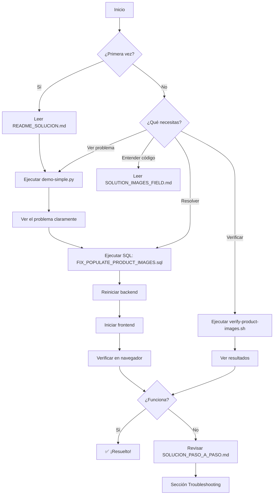

# 📚 Índice de Documentación: Solución de Imágenes de Productos

## 🎯 Inicio Rápido

**¿Primer vez aquí?** → Lee **[README_SOLUCION.md](README_SOLUCION.md)** ⭐

## 📖 Archivos de Documentación

### 1️⃣ Documentación Principal (LEER PRIMERO)

| Archivo | Descripción | Para quién |
|---------|-------------|------------|
| **[README_SOLUCION.md](README_SOLUCION.md)** ⭐ | Resumen completo en español con pasos específicos | **Desarrolladores** |
| [RESUMEN_VISUAL.md](RESUMEN_VISUAL.md) | Explicación visual con screenshots y código | Todos |
| [FIX_IMAGENES_PRODUCTOS.md](FIX_IMAGENES_PRODUCTOS.md) | Resumen ejecutivo del bug | Project Managers |

### 2️⃣ Guías Técnicas Detalladas

| Archivo | Descripción | Cuándo usar |
|---------|-------------|-------------|
| [SOLUCION_PASO_A_PASO.md](SOLUCION_PASO_A_PASO.md) | Guía completa con comandos Windows/Linux | Cuando necesitas instrucciones detalladas |
| [DIAGNOSTIC_R2_IMAGES.md](DIAGNOSTIC_R2_IMAGES.md) | Diagnóstico original del problema | Para entender el contexto histórico |
| [SOLUTION_IMAGES_FIELD.md](SOLUTION_IMAGES_FIELD.md) | Documentación de la implementación del campo Images | Para entender la implementación técnica |

### 3️⃣ Scripts SQL (EJECUTAR ESTOS)

| Archivo | Descripción | Comando |
|---------|-------------|---------|
| **[backend-config/Scripts/FIX_POPULATE_PRODUCT_IMAGES.sql](backend-config/Scripts/FIX_POPULATE_PRODUCT_IMAGES.sql)** ⭐ | Script principal de corrección | `sqlcmd -S localhost -d VentasPet_Nueva -E -i FIX_POPULATE_PRODUCT_IMAGES.sql` |
| [backend-config/Scripts/AddSampleProductImages.sql](backend-config/Scripts/AddSampleProductImages.sql) | Script alternativo (más simple) | `sqlcmd -S localhost -d VentasPet_Nueva -E -i AddSampleProductImages.sql` |
| [backend-config/Scripts/ValidateR2ImageUrls.sql](backend-config/Scripts/ValidateR2ImageUrls.sql) | Script de validación | Para verificar el estado actual |

### 4️⃣ Scripts de Diagnóstico y Demostración

| Archivo | Descripción | Comando |
|---------|-------------|---------|
| [verify-product-images.sh](verify-product-images.sh) | Script de diagnóstico automático | `bash verify-product-images.sh` |
| [demo-simple.py](demo-simple.py) | Demostración visual del problema | `python3 demo-simple.py` |
| [demo-image-fix.sh](demo-image-fix.sh) | Demostración completa con backend | `bash demo-image-fix.sh` |
| [validate-images-field.py](validate-images-field.py) | Validador de campo Images en API | `python3 validate-images-field.py` |

---

## 🚀 Flujo de Trabajo Recomendado



---

## 📋 Checklist de Resolución

Sigue estos pasos en orden:

### Fase 1: Diagnóstico
- [ ] Leer [README_SOLUCION.md](README_SOLUCION.md)
- [ ] Ejecutar `python3 demo-simple.py` para ver el problema
- [ ] Entender que el código está correcto, solo faltan datos

### Fase 2: Corrección
- [ ] Abrir SQL Server Management Studio o Azure Data Studio
- [ ] Ejecutar [FIX_POPULATE_PRODUCT_IMAGES.sql](backend-config/Scripts/FIX_POPULATE_PRODUCT_IMAGES.sql)
- [ ] Verificar que el output muestre "✅ R2 Image" para todos los productos

### Fase 3: Verificación
- [ ] Reiniciar backend: `dotnet run --urls="http://localhost:5135"`
- [ ] Iniciar frontend: `npm start`
- [ ] Abrir navegador: `http://localhost:3333`
- [ ] Abrir DevTools (F12) → Console
- [ ] Verificar logs: "✅ Products with URLImagen: 5"

### Fase 4: Validación (Opcional)
- [ ] Ejecutar `bash verify-product-images.sh`
- [ ] Verificar que todas las imágenes retornan HTTP 200 OK
- [ ] Tomar screenshot del catálogo con imágenes funcionando

---

## 🎯 Preguntas Frecuentes

### ¿Por qué las imágenes no aparecen si el PR fue mergeado?

El PR implementó correctamente el código (backend y frontend), pero **no incluyó la migración de datos**. Es necesario ejecutar un script SQL para poblar el campo `URLImagen` en la base de datos.

### ¿Qué archivo debo ejecutar?

**[backend-config/Scripts/FIX_POPULATE_PRODUCT_IMAGES.sql](backend-config/Scripts/FIX_POPULATE_PRODUCT_IMAGES.sql)**

### ¿Cuánto tiempo toma?

5-10 minutos en total:
- Ejecutar SQL: 1 minuto
- Reiniciar backend: 1 minuto
- Verificar frontend: 1-2 minutos
- Validación adicional: 2-5 minutos

### ¿Qué pasa si las imágenes siguen sin aparecer?

1. Verifica que ejecutaste el SQL correctamente
2. Verifica que reiniciaste el backend
3. Revisa la consola del navegador (F12) para ver errores
4. Ejecuta `bash verify-product-images.sh` para diagnóstico automático
5. Consulta la sección Troubleshooting en [SOLUCION_PASO_A_PASO.md](SOLUCION_PASO_A_PASO.md)

### ¿Las imágenes deben existir en Cloudflare R2?

Sí. Las URLs en el script SQL apuntan a Cloudflare R2:
```
https://www.velykapet.com/productos/alimentos/gatos/CHURU_ATUN_4_PIEZAS_56_GR.jpg
```

Si estas imágenes NO existen físicamente en R2:
- El frontend intentará cargarlas pero mostrará error 404
- Solución: Subir las imágenes a R2 o cambiar las URLs a imágenes existentes

---

## 📞 Soporte

Si después de seguir toda la documentación aún tienes problemas:

1. **Ejecuta el diagnóstico automático:**
   ```bash
   bash verify-product-images.sh > diagnostico.txt
   ```

2. **Comparte el archivo `diagnostico.txt`** junto con:
   - Output del script SQL
   - Logs de la consola del navegador (F12 → Console)
   - Screenshot del catálogo

3. **Revisa la sección Troubleshooting** en:
   - [README_SOLUCION.md](README_SOLUCION.md#-troubleshooting)
   - [SOLUCION_PASO_A_PASO.md](SOLUCION_PASO_A_PASO.md#-troubleshooting)
   - [RESUMEN_VISUAL.md](RESUMEN_VISUAL.md#-troubleshooting)

---

## 📊 Estructura de Archivos

```
velykapet-copia-cursor/
├── README_SOLUCION.md ⭐ LEER PRIMERO
├── RESUMEN_VISUAL.md
├── FIX_IMAGENES_PRODUCTOS.md
├── SOLUCION_PASO_A_PASO.md
├── INDICE_DOCUMENTACION_SOLUCION.md (este archivo)
├── backend-config/
│   └── Scripts/
│       ├── FIX_POPULATE_PRODUCT_IMAGES.sql ⭐ EJECUTAR ESTE
│       ├── AddSampleProductImages.sql
│       └── ValidateR2ImageUrls.sql
├── verify-product-images.sh
├── demo-simple.py
├── demo-image-fix.sh
└── validate-images-field.py
```

---

## ✅ Resumen Ejecutivo

| Aspecto | Estado | Acción |
|---------|--------|--------|
| Código Backend | ✅ Correcto | Ninguna |
| Código Frontend | ✅ Correcto | Ninguna |
| PR #48 | ✅ Correcto | Ninguna |
| Base de Datos | ❌ URLImagen vacío | **Ejecutar SQL** ⭐ |
| Documentación | ✅ Completa (9 archivos) | Leer y seguir |

**Próximo paso:** [README_SOLUCION.md](README_SOLUCION.md) → Ejecutar SQL → Verificar

---

**Creado por:** GitHub Copilot Agent  
**Fecha:** Enero 2025  
**Repository:** angra8410/velykapet-copia-cursor  
**Issue:** Imágenes de productos no se muestran en el catálogo
