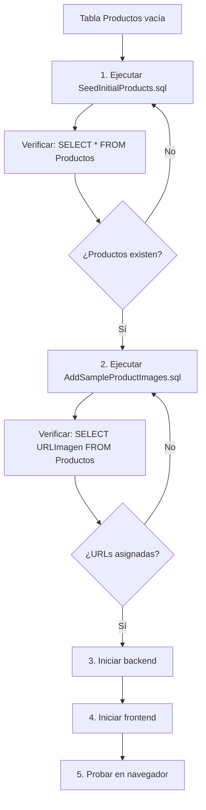

# 🚀 Guía de Configuración de Base de Datos - VentasPet_Nueva

## 📋 Problema Identificado

Si ejecutas el script `AddSampleProductImages.sql` y obtienes:

```
IdProducto  NombreBase  URLImagen
----------- ----------- ---------
(0 rows affected)
```

**Significa que tu tabla `Productos` está vacía.** El script de imágenes intenta hacer UPDATE a productos que no existen.

## ✅ Solución: Proceso Completo en 2 Pasos

### Paso 1: Poblar Productos Iniciales

Primero debes crear los productos base. **Elige UNA de estas opciones:**

#### Opción A: Script SQL Manual (Recomendado para SQL Server)

```bash
# Desde el directorio raíz del proyecto
sqlcmd -S localhost -d VentasPet_Nueva -E -i backend-config/Scripts/SeedInitialProducts.sql
```

Este script creará:
- ✅ 4 Categorías (Alimento Perros, Alimento Gatos, Snacks, Accesorios)
- ✅ 3 Proveedores (Royal Canin, Hill's, Purina)
- ✅ 5 Productos base
- ✅ 15 Variaciones de productos (3 por producto)

#### Opción B: Batch Automatizado (Windows)

```bash
# Desde el directorio backend-config/Scripts
cd backend-config\Scripts
SetupCompleteDatabase.bat
```

Este batch ejecuta automáticamente los 2 pasos en orden:
1. Seed de productos iniciales
2. Actualización de imágenes R2

#### Opción C: Migraciones de Entity Framework

```bash
# Desde el directorio backend-config
cd backend-config
dotnet ef database update
```

Las migraciones de EF ya incluyen el seed de productos en `VentasPetDbContext.cs`.

### Paso 2: Actualizar URLs de Imágenes

**Solo después** de que los productos existan:

```bash
sqlcmd -S localhost -d VentasPet_Nueva -E -i backend-config/Scripts/AddSampleProductImages.sql
```

Este script actualiza los 5 productos con URLs de Cloudflare R2:
- Producto 1: Royal Canin Adult → `https://www.velykapet.com/productos/alimentos/perros/ROYAL_CANIN_ADULT.jpg`
- Producto 2: Churu Atún → `https://www.velykapet.com/productos/alimentos/gatos/CHURU_ATUN_4_PIEZAS_56_GR.jpg`
- Producto 3: BR FOR CAT VET → `https://www.velykapet.com/productos/alimentos/gatos/BR_FOR_CAT_VET.jpg`
- Producto 4: Hill's Puppy → `https://www.velykapet.com/productos/alimentos/perros/HILLS_SCIENCE_DIET_PUPPY.jpg`
- Producto 5: Purina Cat → `https://www.velykapet.com/productos/alimentos/gatos/PURINA_PRO_PLAN_ADULT_CAT.jpg`

## 🔍 Verificación

### 1. Verificar que los productos existen:

```sql
USE VentasPet_Nueva;
SELECT IdProducto, NombreBase, TipoMascota 
FROM Productos 
ORDER BY IdProducto;
```

**Resultado esperado:**
```
IdProducto  NombreBase                      TipoMascota
----------- ------------------------------- ------------
1           Royal Canin Adult               Perros
2           Churu Atún 4 Piezas 56gr       Gatos
3           Hill's Science Diet Puppy       Perros
4           Purina Pro Plan Adult Cat       Gatos
5           Hill's Science Diet Adult       Perros
```

### 2. Verificar que las imágenes están asignadas:

```sql
SELECT IdProducto, NombreBase, URLImagen,
    CASE 
        WHEN URLImagen LIKE 'https://www.velykapet.com/%' THEN '✅ R2 Image'
        WHEN URLImagen IS NULL OR URLImagen = '' THEN '❌ No Image'
        ELSE '⚠️ Other Source'
    END AS ImageStatus
FROM Productos
ORDER BY IdProducto;
```

**Resultado esperado:**
```
IdProducto  NombreBase                  URLImagen                                          ImageStatus
----------- --------------------------- -------------------------------------------------- ------------
1           Royal Canin Adult           https://www.velykapet.com/.../ROYAL_CANIN_ADULT.jpg  ✅ R2 Image
2           Churu Atún 4 Piezas 56gr   https://www.velykapet.com/.../CHURU_ATUN...jpg       ✅ R2 Image
3           Hill's Science Diet Puppy   https://www.velykapet.com/.../HILLS_PUPPY.jpg        ✅ R2 Image
4           Purina Pro Plan Adult Cat   https://www.velykapet.com/.../PURINA_CAT.jpg         ✅ R2 Image
5           Hill's Science Diet Adult   https://www.velykapet.com/.../HILLS_ADULT.jpg        ✅ R2 Image
```

## 🛠️ Scripts Disponibles

| Script | Propósito | Cuándo Usar |
|--------|-----------|-------------|
| `SeedInitialProducts.sql` | Crea categorías, proveedores, productos y variaciones | Cuando la tabla Productos está vacía |
| `AddSampleProductImages.sql` | Actualiza URLs de imágenes R2 | Después de tener productos |
| `SetupCompleteDatabase.bat` | Ejecuta ambos scripts en orden | Setup inicial completo (Windows) |
| `seed-example-product.sql` | Agrega 1 producto específico con validaciones | Para agregar productos individuales |

## 🚨 Troubleshooting

### Problema: "Changed database context to 'VentasPet_Nueva'. (0 rows affected)"

**Causa:** La tabla Productos está vacía.

**Solución:** Ejecutar primero `SeedInitialProducts.sql`

### Problema: "Cannot insert duplicate key row in object 'dbo.Productos'"

**Causa:** Los productos ya existen.

**Solución:** Los productos ya están creados. Puedes ejecutar directamente `AddSampleProductImages.sql`

### Problema: Las imágenes no se ven en el frontend

**Posibles causas:**

1. **Backend no está corriendo:**
   ```bash
   cd backend-config
   dotnet run --urls="http://localhost:5135"
   ```

2. **Frontend no está corriendo:**
   ```bash
   npm start
   ```

3. **Las imágenes no existen en Cloudflare R2:**
   - Verificar en Network tab (F12) si hay errores 404
   - Subir las imágenes a R2 con los nombres correctos

4. **URLs incorrectas en la base de datos:**
   - Verificar con la query de verificación arriba
   - Ejecutar de nuevo `AddSampleProductImages.sql`

## 📚 Orden Correcto de Operaciones


```mermaid
graph TD
    A[Tabla Productos vacía] --> B[1. Ejecutar SeedInitialProducts.sql]
    B --> C[Verificar: SELECT * FROM Productos]
    C --> D{¿Productos existen?}
    D -->|No| B
    D -->|Sí| E[2. Ejecutar AddSampleProductImages.sql]
    E --> F[Verificar: SELECT URLImagen FROM Productos]
    F --> G{¿URLs asignadas?}
    G -->|No| E
    G -->|Sí| H[3. Iniciar backend]
    H --> I[4. Iniciar frontend]
    I --> J[5. Probar en navegador]
```

## 🎯 Buenas Prácticas

### ✅ DO (Hacer):

1. **Verificar antes de ejecutar:** Siempre verificar el estado actual de la BD antes de ejecutar scripts
2. **Usar transacciones:** Los scripts usan BEGIN TRANSACTION / COMMIT para seguridad
3. **Validar dependencies:** Los scripts validan que existen categorías y proveedores antes de insertar productos
4. **Evitar duplicados:** Los scripts verifican si los datos ya existen antes de insertarlos
5. **Revisar logs:** Leer los mensajes de los scripts para entender qué se está ejecutando

### ❌ DON'T (No hacer):

1. **No ejecutar scripts de imágenes primero:** Siempre poblar productos antes de imágenes
2. **No ignorar errores:** Si hay errores, no continuar a la siguiente etapa
3. **No asumir que funcionó:** Siempre verificar con queries SELECT
4. **No modificar IDs manualmente:** Dejar que IDENTITY_INSERT maneje los IDs
5. **No ejecutar múltiples veces sin verificar:** Evitar duplicados innecesarios

## 💡 Comandos Rápidos de Referencia

```bash
# Ver productos
sqlcmd -S localhost -d VentasPet_Nueva -E -Q "SELECT IdProducto, NombreBase FROM Productos"

# Ver productos con imágenes
sqlcmd -S localhost -d VentasPet_Nueva -E -Q "SELECT IdProducto, NombreBase, URLImagen FROM Productos"

# Contar productos
sqlcmd -S localhost -d VentasPet_Nueva -E -Q "SELECT COUNT(*) AS Total FROM Productos"

# Limpiar todos los productos (CUIDADO - borra todo)
sqlcmd -S localhost -d VentasPet_Nueva -E -Q "DELETE FROM VariacionesProducto; DELETE FROM Productos; DELETE FROM Categorias; DELETE FROM Proveedores;"
```

## 📞 Soporte

Si después de seguir esta guía aún tienes problemas, proporciona:

1. Output completo de `SELECT * FROM Productos`
2. Output completo del script que ejecutaste
3. Screenshot de la consola del navegador (F12)
4. Screenshot del Network tab mostrando el request a `/api/Productos`

---

**Creado:** 2024  
**Última actualización:** 2024  
**Autor:** GitHub Copilot Agent
